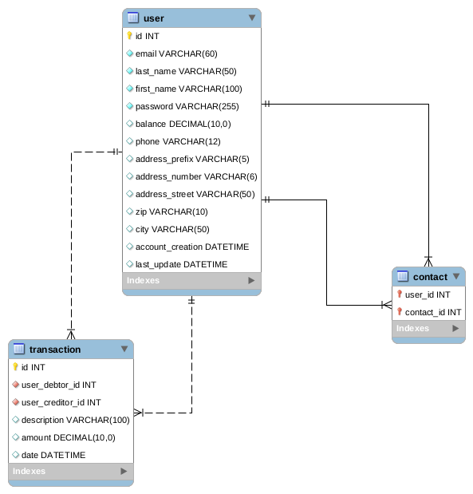
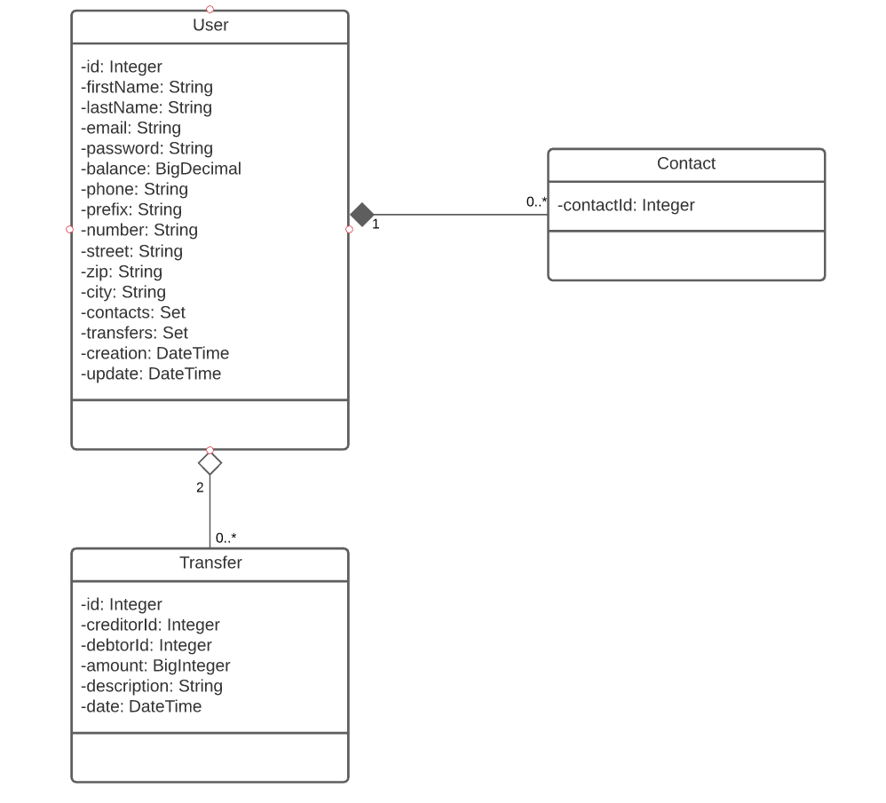

DB : MySql  
Java : 11  
Build : Maven 3.6.0  
SpringBoot : 2.5.0  
DB script : src/main/resources/create_db_mysql.sql   
<h3>Modèle physique des données pour la base de données</h3> 

<h3>Diagramme de classe</h3> 

Monetization : 0.5% charge on Transfer, saved on DB table user (id == 1)

